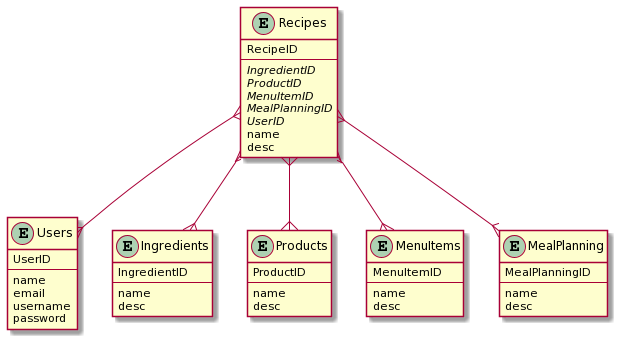

- [Running](#running)
  - [Development](#development)
  - [Production](#production)
- [Development Book](#development-book)
  - [Team Members and Roles](#team-members-and-roles)
  - [Background and Project Description](#background-and-project-description)
    - [Background](#background)
    - [Project Idea](#project-idea)
    - [Summary](#summary)
    - [Goals](#goals)
    - [Scope](#scope)
  - [Project Requirements](#project-requirements)
    - [Stakeholders](#stakeholders)
    - [Input](#input)
    - [Processing](#processing)
    - [Output](#output)
  - [Technologies Used](#technologies-used)
  - [Design Patterns](#design-patterns)
    - [Model-View-Controller](#model-view-controller)
    - [Factory Method](#factory-method)
  - [Layering](#layering)
    - [Presentation Layer](#presentation-layer)
      - [User Information Class](#user-information-class)
      - [View](#view)
    - [Business Layer](#business-layer)
      - [Controllers](#controllers)
    - [Data Layer](#data-layer)
      - [Database Schema](#database-schema)
  - [Timeline](#timeline)

# Running

- Make sure [Node.js](https://nodejs.org/) is installed
- Install dependencies by running `npm install`

## Development

- Run the server as well as the client development server with `npm run dev`
- A development server will start at [http://localhost:3000/](http://localhost:3000/)

Note: changing the server port from the default will break the proxy in the client's development server.

## Production

- Compile frontend code with `npm run build`
- Run the server with `npm start`
- By default, a server is started at [http://localhost:8080/](http://localhost:8080/)

# Development Book

## Team Members and Roles

- **Ike Chukwunyerenwa**  
  Database Developer
- **Alex Ketavongsa**  
  Frontend Developer
- **Tyler Pache**  
  Full-Stack Developer
- **Rachael Simmonds**  
  Frontend Developer
- **Tim Tills**  
  Backend Developer / Database Developer

## Background and Project Description

### Background

Meal planning is often a dreaded task and it can be difficult to find time for it in our busy lives. It’s often easier and quicker to pick up a Burger King meal for dinner than to cook up a homemade meal. Another point is cooking is not the easiest task for everyone.

There are many apps out there such as *Mealime*, *eMeals*, and *Yummly* that provide step-by-step instructions on making different meals. There are options to add food items for breakfast, lunch, and dinner for each day and calculate the nutritional value (calories, protein, fat, carbs).

However, some meal planning apps make it hard to put everything you really eat on your meal plan, or the process is so complicated that it takes all the enjoyment out of your food. For instance, many recipe search engines fail to show relevant recipes because it relies on specific search keywords. If you search for "burrito no beans" you might see a result for "three-bean burrito" because of the "bean" keyword.

Spoonacular is different from the competitors. You can collect your favorite recipes, find the right packaged foods for your lifestyle, save your usual restaurant meals, and automatically track your daily nutrition. Spoonacular finds healthy recipes by calculating the nutritional information. This means that recipes are not curated based on what we deem as "healthy" just because its gluten-free or vegan. On top of all that, the app is completely free with no charges to unlock "premium" features.

### Project Idea

Spoonacular Inc. Recipe Database

### Summary

The CEO of "Spoonacular Inc." has reached out to us to create a database based on their business - recipes. They have been struggling with world-wide profits of their recipe book because shipping and handling cost is greater in most international countries. They want us to create this online database in order for those around the world and/or locally want quicker and cheaper access to their recipes through an online database.

Within the database, we would like the users/customers to be able to get a name of the recipe they want to access based on what the database provides, a date of when the recipe was accessed by them, what time they started to view the recipe, what time they completed viewing the recipe, and perhaps the quality of how the food turned out for overall feedback for the company to improve their recipes within the database for other consumers.

The users will be able to have access to the recipes through a database based on what food/recipe they look up within the database. The database should also allow the consumers to create new recipes in case they do not follow the exact recipe within the database, which they could create their own personal set of recipes that will be public to the “Spoonacular” database. Our database system will allow consumers to filter recipes based on the ingredients they provide or search for. We want their consumers to have easy access to the customer's recipes on an online database without paying a fortune in order to get it. This project should boost our customers sales world-wide.

### Goals

Our biggest goal is to make our customer happy but also be able to meet all of their desired requirements for the online database for their recipes. We want to be able to follow the standards to create the database so its functionality will not have any hiccups while the customer's consumers are utilizing it.

First we need to create a design that is able to be structured in time for our customer's needs. Second our tables should be linked in a way that is not repetitive which leaves the database structure looking redundant. Third, all the information in the database should be correct and correctly formatted. If a consumer is trying to make the recipe "spaghetti" that recipe should not return faulty ingredients such as "1 chocolate bar." We want accuracy within each table when a consumer is using the database. This should be thought about logically while inserting information into the database.

### Scope

Over the course of this project, we will create an application that is able to:
- Let users login and register accounts
- Search recipes based on name and ingredients
- Record when the user accessed each recipe
- Record how long the user spent looking at a recipe
- Record feedback generated by the user about how their food turned out
- Record new recipes created by users

This application will use a client-server architecture, with a server-side written in Node.js and a client-side written in React.js. The client and server will communicate via a REST API, and the server will interface with a database to store persistent data.

## Project Requirements

### Stakeholders

The stakeholders in this project will be the customers, managers, developers, and vendors. The customers are responsible for establishing design requirements as well as using and running the system. The customer's interaction is between the vendors who provide the goods and services. The developers are responsible for adhering to the design requirements and writing the code. The managers are responsible for meeting deadlines and budgets. The managers are dependent on the vendors to communicate the customer's requirements to the developer. The vendors are responsible for ensuring that the application is cross-compatible with their platform.

### Input

In regards to input the application will need to handle input from the user when looking for specific items in addition to handling authentication and authorization. For a new user they will need to go through the process of entering in their information to create an account. If the user already has an account they will need to login to their account to view/edit saved recipes, add recipes of their own.

With this the application will need to be able to accept the various fields necessary for recipes from: ingredients, instructions, serving size, cuisine and possibly nutrition facts. On the opposite end, a user looking to find a recipe will need to be able to input the ingredients they have and be shown a list of possible recipes they can make from the list they provided.

### Processing

The app will handle calls to a database as well as to an API. The calls to the database will be to verify login values from the consumers and keep track of saved recipe lists from the database. Users will also be able to add, delete and modify their own recipes into the database to be able to share with other users. The calls to the API will be based on the ingredients provided by the user, specific to the recipe names.

In addition, the application will process the information passed in by the user and will clean it to make sure there will be no injections made to the databases. This will allow the application to be safer overall for all involved.

### Output

The output refers to any information requested within the database for recipes being processed by a server within the computer to be sent back to the consumer. This allows the consumers to view recipes without waiting extensive amounts of time.

An example of the output is that any recipe that is viewed by the user on their computer monitor lets him and/or her look at the information, such as ingredients or steps, when the output is coming out. After he and/or she requested for his and/or her information, such as ingredients, he and/or she inputs through a keyboard. The goal is to make sure that the consumer of our customer gets information from what he and/or she has requested and to make sure it is valid information. 

As the developers, we are focusing on how MySQL executes statements within the recipe database. It will explain how to return a row of information for each table used in the query which includes: `SELECT`, `INSERT`, `UPDATE`, and `DELETE` statements or our C.R.U.D. The tables listed in the output in the correct order that MySQL would allow us to read all the tables listed while running the statements.

## Technologies Used

- Server side
  - Data Layer
    - **MySQL**  
      Production-ready database
    - **SQLite**  
      Embedded DBMS good for local development and testing
  - Business Layer
    - **Node.js**  
      Server-side Javascript runtime
    - **Express.js**  
      Simplifies the creation of REST APIs
- Client side
  - Presentation Layer
    - **React.js**  
      Frontend framework for constructing reactive user interfaces
    - **Redux**  
      Manages application state in a functional style
    - **Material UI**  
      Provides reusable components following the Material Design guidelines

## Design Patterns

### Model-View-Controller

This application will use a client-server model, with most of the logic taking place on the server-side. The Model-View-Controller pattern will be used on the server side to organize the code and designate responsibilities between the different layers.

The Model will be backed by data in the database, as well as the Spoonacular API. The data layer will sufficiently abstract the structures contained in the backend, and provide CRUD methods.

The View and Controller will be connected to the API, as this is how the user (through the frontend) will interface with the application. The API will follow REST principles, using different HTTP methods semantically, and sending information in JSON format.

The View will consist of the data returned by GET requests to the API.

The Controller will consist of listeners to POST, PUT, DELETE, and other methods on the API.

### Factory Method

This application will be built to use either of 2 DBMSs, SQLite and MySQL. In order to use both effectively, abstraction classes implementing the same interface need to be created from their respective drivers, and a configuration file will need to be interpreted to decide which database type will be used.

A factory method can be used to decide which class will be instantiated, with a general form that looks like:

```js
const { sqlite } = require("./drivers/sqlite");
const { mysql } = require("./drivers/mysql");

const dbTypes = {
  sqlite,
  mysql
};

module.exports.createDBConnection = config => {
  if(config.db.type in dbTypes){
    return new dbTypes[config.db.type](config.db.opts);
  }
};
```

## Layering

### Presentation Layer

The presentation layer will allow the audience/user to interact with the application depending on their needs for gathering information about new recipes and/or ingredients. They should have access to only view the output data from the server in a way that won’t expose critical data to them. The inner layers must be secured enough so we do not have any critical data leaked to the presentation layer.

#### User Information Class

Contains information about the User that registers on the site. Fields include first name, email address, username, password.

#### View

Consists of the data returned by GET requests to the API.
Listed below are some functions available in the Spoonacular API.

Get Recipe Information by calling a recipe id.  
GET https://api.spoonacular.com/recipes/{id}/information  
GET https://api.spoonacular.com/recipes/random  
GET https://api.spoonacular.com/food/ingredients/{id}/information  
GET https://api.spoonacular.com/recipes/{id}/summary  
GET https://api.spoonacular.com/food/products/search  
GET https://api.spoonacular.com/recipes/{id}/information

### Business Layer

The business layer will be in communication with both the presentation layer and the data layer. Information from the presentation layer will be sanitized to make sure the users haven’t injected anything that may harm the program before passing the request to the data layer. Upon receiving the results from the query, the business layer will make sure the information is readable for the presentation layer then send the information to the layer.

#### Controllers

Will be the listeners that will activate once the user decides to create (POST), update (PUT), or delete (DELETE) any recipes or ingredients. For example, if they have recent searches or favorite recipes/ingredients saved they can modify them within the database.

### Data Layer

The data layer will be in charge of interfacing with the database and abstracting database operations from the rest of the program. It will use polymorphism to connect to multiple database management systems, and will abstract the CRUD operations as methods.


#### Database Schema



## Exception Handling

Javascript is built on an asynchronous event-based model, which lets it run on a single thread while executing multiple things at a time
to do this, it's split up into synchronous "blocks" of code, each of which might schedule something to be executed in the future
each of these blocks should take next to no time to execute
a constraint of this is try/catch blocks only catch errors happening on the same "block" of code
for example, this error won't be caught, because the error occurs in a function scheduled to run after the try/catch block is done executing:
```js
try{
    setTimeout(function(){
        throw new Error();
    }, 1000);
}catch(e){
    console.error("Error", e);
}
```
On the data layer, we've been using Promises, a neat thing for asynchronous code execution, that have exception propagation features
all the methods on the data layer return Promises, and you can call the .catch method on them to handle errors whenever they arise
on the business layer, Express.js surrounds your callbacks in a try/catch so it can detect synchronous errors and return a 500 code indicating an error occurred in situations like this:
```js
app.get("/", (req, res) => {
    throw new Error();
})
```
However, when working with Promises, exception handling doesn't occur within the same code block
so you need to do something like this:
```js
app.get("/", (req, res, next) => {
    db.getItem() //or whatever the function is
        .then(result => res.send(result))
        .catch(next)
})
```

## Timeline

| Milestones                                | Meeting Start Date/Time   | Meeting End Date/Time   | Due Date                  |
| ----------------------------------------- | ------------------------- | ----------------------- | ------------------------- |
| Milestone 01. Requirements                | Aug 20, 2020, 4 PM        | Aug 26, 2020, 6 PM      | Aug 31, 2020, 11:59 PM    |
| Milestone 02. Design and Design Patterns  | Sept 18, 2020, 4 PM       | Sept 18, 2020, 6 PM     | Sept 18, 2020, 11:59 PM   |
| Milestone 03. Layering                    | Sept 23, 2020, 4 PM       | Sept 23, 2020, 6 PM     | Sept 25, 2020, 11:59 PM   |
| Milestone 04. Exception Handling          | Oct 7, 2020, 4 PM         | Oct 7, 2020, 6 PM       | Oct 9, 2020, 11:59 PM     |
| Milestone 05. Performance and Refactoring | Oct 21, 2020, 4 PM        | Oct 21, 2020, 6 PM      | Oct 23, 2020, 11:59 PM    |
| Milestone 06. Testing                     | Nov 6, 2020, 4 PM         | Nov 6, 2020, 6 PM       | Nov 9, 2020, 11:59 PM     |
| Milestone 07. Deploying, Packaging        | Nov 11, 2020, 4 PM        | Nov 11, 2020, 6 PM      | Nov 13, 2020, 11:59 PM    |
| Finalized Code                            | Nov 18, 2020, 4 PM        | Nov 18, 2020, 6 PM      | Nov 20, 2020, 6 PM        |
